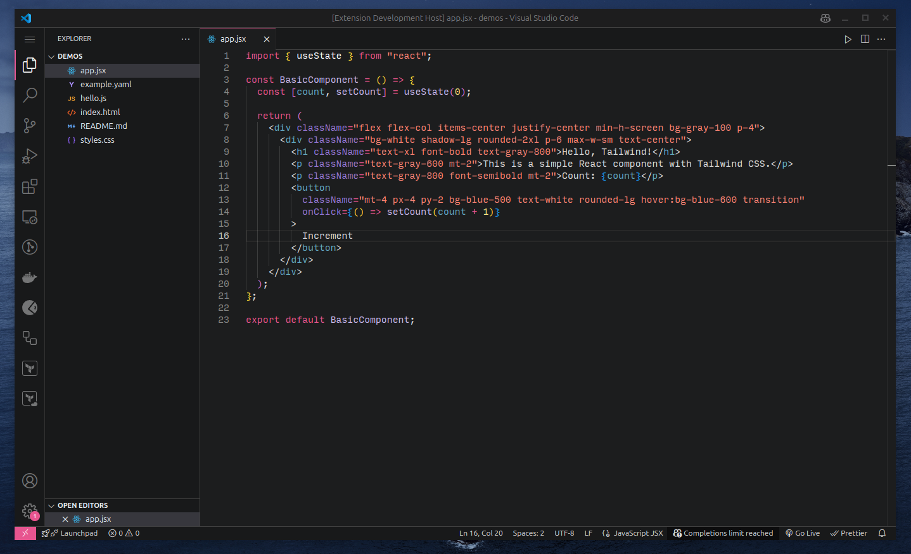

# VXCode Theme

A modern and elegant dark theme for Visual Studio Code, inspired by the aesthetics of Xcode. Designed to provide a smooth and visually appealing coding experience.

## Screenshots

### Default Theme

## Installation

### From VS Code Marketplace
1. Open **Visual Studio Code**.
2. Go to **Extensions** (`Ctrl+Shift+X` or `Cmd+Shift+X` on macOS).
3. Search for **VXCode Theme**.
4. Click **Install**.
5. Select the theme by navigating to **File > Preferences > Color Theme** and choosing **VXCode Theme - Default**.

### Manual Installation
1. Download the latest release from [GitHub](#) (add link if available).
2. Open **Visual Studio Code**.
3. Go to **Extensions** and click **Install from VSIX...**.
4. Select the downloaded `.vsix` file.

## Activation
To activate the theme:
1. Open **Command Palette** (`Ctrl+Shift+P` or `Cmd+Shift+P` on macOS).
2. Type `Preferences: Color Theme` and select **VXCode Theme - Default**.

## Contribution
We welcome contributions! If you have suggestions, feel free to open an issue or submit a pull request on [GitHub](#) (add link if available).

## License
This theme is licensed under the **MIT License**. See the [LICENSE](LICENSE) file for more details.

---
Enjoy coding with **VXCode Theme**! 🚀
